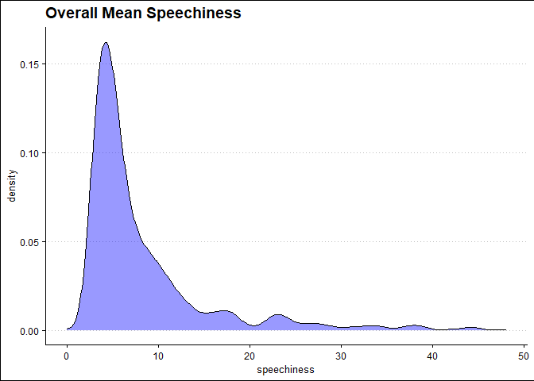

Exploring Spotify Music Data
================
By Mwangi George
Last edited Nov, 17 2022

-   <a href="#amount-of-spoken-words" id="toc-amount-of-spoken-words">Amount
    of Spoken Words</a>
-   <a href="#loudness" id="toc-loudness">Loudness</a>

# Amount of Spoken Words

This section aims to explore the amount of spoken words in the spotify
dataset. This variable is represented by the speechiness column, where
more values mean more spoken words. Lets start by understanding the
general statistics about the variable by calculating the overall mean,
median and other statistics as follows.

``` r
summary(spotify$speechiness)
```

    ##    Min. 1st Qu.  Median    Mean 3rd Qu.    Max. 
    ##   0.000   4.000   5.000   8.358   9.000  48.000

From the above output, we can see that, all the songs from 2010 to 2019
have an average speechiness score of 8.36 and a median score of 5. The
minimum and maximum speechiness scores are 0 and 48 respectively. There
is quite a big difference between the mean and the median, which means
there are outliers in the variable. Let’s utilize a density plot to
explore visualize the distribution of the overall speechiness of the
songs.

``` r
spotify %>% 
  ggplot(aes(speechiness, group =1))+
  geom_density(fill = "blue", alpha = .4)+
  theme_clean() +
  labs(
    title = "Overall Mean Speechiness",
  )
```

<!-- -->

The distribution of speechiness is heavily skewed to the right. This
explains why the mean is greater than than the median. This skewness
renders the mean a poor measure of centrality. We should therefore use
the median as a safer alternative to describe centrality of the
speechiness variable. Let’s therefore explore how the median speechiness
of the songs varied over time.

``` r
spotify %>%
  group_by(year) %>%
  summarise(median_speechiness = median(speechiness)) %>%
  ggplot(aes(factor(year), median_speechiness, group = 1)) +
  geom_line() +
  geom_point() +
  expand_limits(y = c(4, 10)) +
  theme_clean() +
  labs(
    title = "Median Speechiness over time",
    x = "Year",
    y = "Median Speechiness"
  )
```

<!-- -->

According to the above graph, from 2010 to 2015, the median level of
speechiness remained at 5. In 2016, this value increased to 6, and it
stayed that way until 2018, when it dropped back to 5.

Let’s explore the association between speechiness and popularity of the
songs.

``` r
# correlation coefficient
cor(spotify$speechiness, spotify$popularity)
```

    ## [1] -0.04149019

The correlation coefficient between the variables speechiness and
popularity is -0.0415. This value means that there exists a weak
negative association between speechiness and popularity. More words in a
song mean is associated with reduced popularity but this association is
very weak. We can visualize this relationship using a scatter plot.

``` r
spotify %>%
  ggplot(aes(speechiness, popularity)) +
  geom_jitter(color = "blue", alpha = .4) +
  theme_clean() +
  labs(
    title = "Popularity Vs Speechiness",
    x = "Speechiness",
    y = "Popularity"
  )
```

<!-- -->

# Loudness

In this part, we are going to explore Loudness of the songs. Let’s start
by calculating summary statistics of variable.

``` r
summary(spotify$song_loudness)
```

    ##    Min. 1st Qu.  Median    Mean 3rd Qu.    Max. 
    ## -60.000  -6.000  -5.000  -5.579  -4.000  -2.000

On average, a song has an average loudness of -5.579 decibel. The
minimum and maximum loudness values are -60 decibel and -2 decibel
respectively. We can utilize a histogram to visualize the distribution.

``` r
spotify %>% 
  ggplot(aes(song_loudness))+
  geom_histogram(bins = 30)+
  theme_clean()+
  labs(title = "Distribution of song loudness")
```

<!-- -->

``` r
spotify %>% 
  filter(song_loudness == -60)
```

    ## # A tibble: 1 × 15
    ##      id song_title   song_…¹ top_g…²  year beats…³ song_…⁴ dance…⁵ song_…⁶  live
    ##   <dbl> <chr>        <chr>   <chr>   <dbl>   <dbl>   <dbl>   <dbl>   <dbl> <dbl>
    ## 1   443 Million Yea… Adele   britis…  2016       0       0       0     -60     0
    ## # … with 5 more variables: valence <dbl>, duration <dbl>, acousticness <dbl>,
    ## #   speechiness <dbl>, popularity <dbl>, and abbreviated variable names
    ## #   ¹​song_artist, ²​top_genre, ³​beats_per_min, ⁴​song_energy, ⁵​danceability,
    ## #   ⁶​song_loudness

We learn that most of the values lie between -12 dB and -5 dB. There is
one song, however, “Million Years Ago” by Adele, with -60 dB. Notice
that this is the same identified with zero words. We can take this
analysis further by exploring the correlation between loudness and
popularity of a song.

``` r
# correlation coeffient between song loudness and popularity
cor(spotify$song_loudness, spotify$popularity)
```

    ## [1] 0.1568972

The output suggests shows that there is a weak positive association
between the loudness of a song and its popularity. More loudness in a
song is associated with more popularity. Let’s visualize this
relationship with a scatter plot.

``` r
spotify %>% 
  mutate(year = as.factor(year)) %>% 
  ggplot(aes(song_loudness, popularity))+
  geom_jitter(alpha = .5)+
  facet_wrap(~ year)+
  labs(title = "Popularity Versus Loudness")
```

<!-- -->

The relationship is not very clear but we can see that in 2019, most
songs had higher sound and were associated with high popularity compared
to 2016 where some songs had low sound and were associated with low
popularity.
